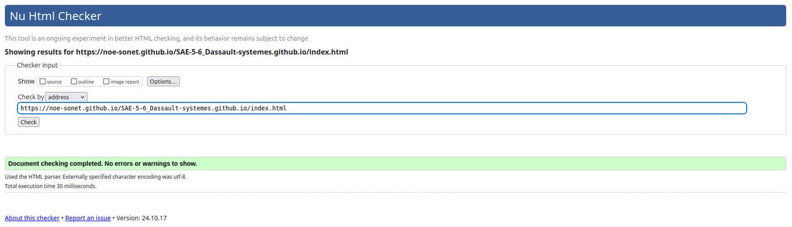
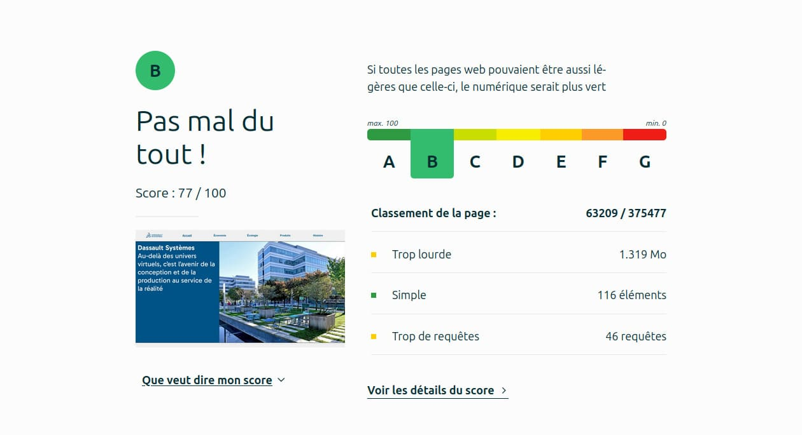
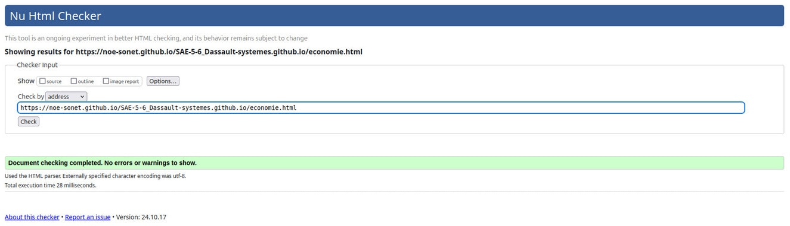
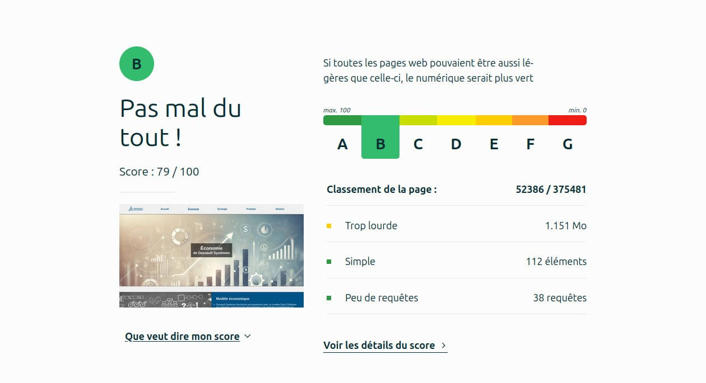
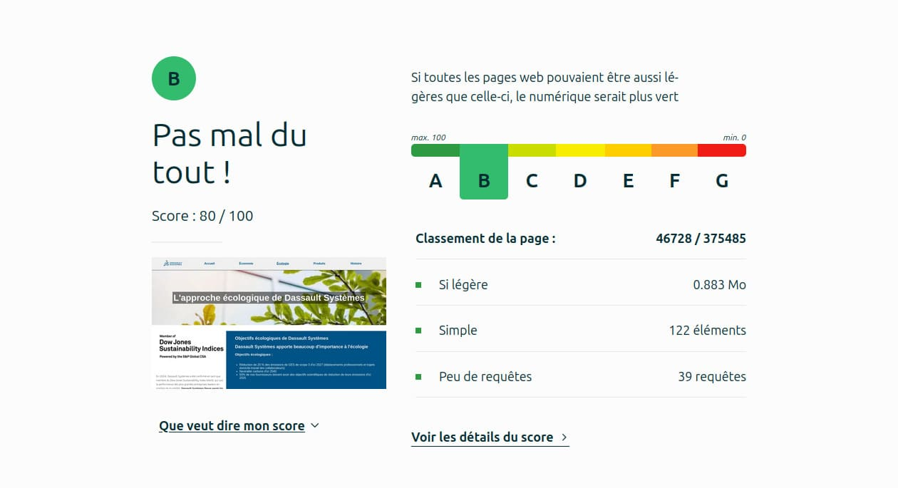
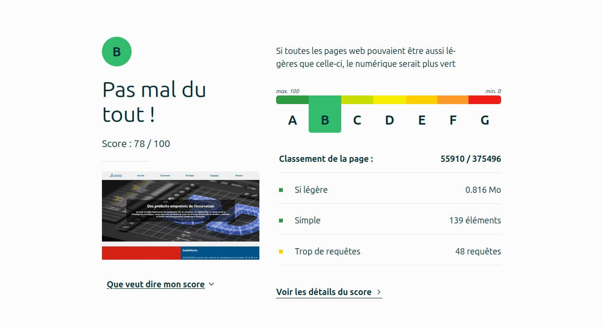
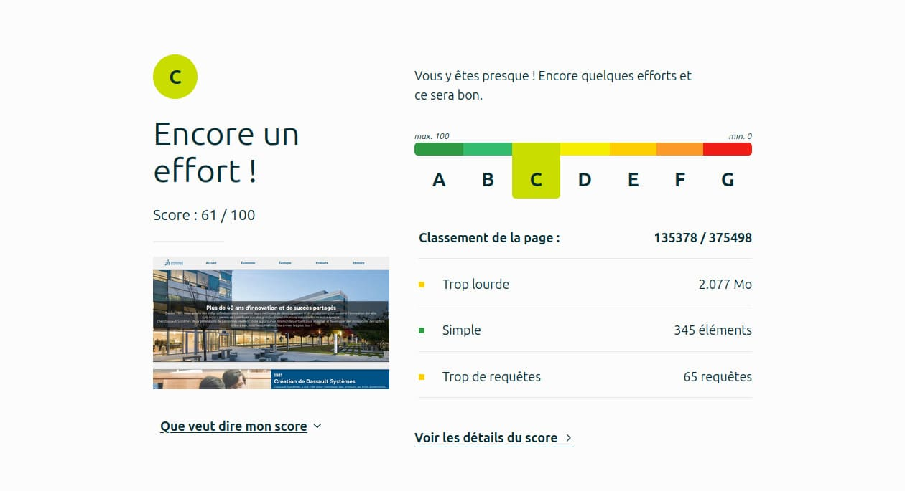

# SAÉ S1. 05-06 - Groupe 18 

## Dassault Systèmes 

[SAE-5-6_Dassault-systemes](https://noe-sonet.github.io/SAE-5-6_Dassault-systemes.github.io/) 

## Membres du groupe : 

- [RUYER Benjamin (Référent)](mailto:benjamin.ruyer@edu.univ-fcomte.fr?subject=SAE_1_05_06)
- [SONET Noé](mailto:noe.sonet@edu.univ-fcomte.fr?subject=SAE_1_05_06) 
- [SPRINGER Théo](mailto:theo.springer@edu.univ-fcomte.fr?subject=SAE_1_05_06) 
- [TOMASZEWSKI--VILLALDEA MARTIN Maeva](mailto:maeva.tomaszewski--villaldea_martin@edu.univ-fcomte.fr?subject=SAE_1_05_06) 
- [VADEBOIN Kylian](mailto:kylian.vadeboin@edu.univ-fcomte.fr?subject=SAE_1_05_06) 

# Présentation du projet

Ce dépôt contient un site web réalisé en HTML, CSS et JS dans le cadre de la SAÉ 05-06 à l'IUT de Nord Franche-Comté. Ce site propose des informations sur l'entreprise Dassault Systèmes et sert de vitrine pour présenter ses activités, son organisation, son historique et ses caractéristiques. Vous trouverez dans ce dépôt, ainsi que sur le site, un rapport économique qui analyse l'aspect économique de Dassault Systèmes.

## Développement Site Web et Validation des pages

### Page d'accueil

**Auteur : RUYER Benjamin**

Verification W3C : [Détail ICI](https://validator.w3.org/nu/?doc=https%3A%2F%2Fnoe-sonet.github.io%2FSAE-5-6_Dassault-systemes.github.io%2Findex.html)
 

 

### Page sur l'économie

**Auteur : SPRINGER Théo**

Verification W3C : [Détail ICI](https://validator.w3.org/nu/?doc=https%3A%2F%2Fnoe-sonet.github.io%2FSAE-5-6_Dassault-systemes.github.io%2Feconomie.html)
 

 

### Page sur l'écologie

**Auteur : SONET Noé**

Verification W3C : [Détail ICI](https://validator.w3.org/nu/?doc=https%3A%2F%2Fnoe-sonet.github.io%2FSAE-5-6_Dassault-systemes.github.io%2Fecologie.html)
 

 

### Page présentatrice des produits

**Auteur : TOMASZEWSKI--VILLALDEA MARTIN Maeva**

Verification W3C : [Détail ICI](https://validator.w3.org/nu/?doc=https%3A%2F%2Fnoe-sonet.github.io%2FSAE-5-6_Dassault-systemes.github.io%2Fproduits.html)
 

 

### Page présentatrice de l'histoire

**Auteur : VADEBOIN Kylian** 

Verification W3C : [Détail ICI](https://validator.w3.org/nu/?doc=https%3A%2F%2Fnoe-sonet.github.io%2FSAE-5-6_Dassault-systemes.github.io%2Fhistoire.html)
 

 

## Répartition du travail

### Planification - Diagramme de GANTT

- RUYER Benjamin

### Recherches d'informations

- RUYER Benjamin
- SPRINGER Théo
- SONET Noé
- TOMASZEWSKI--VILLALDEA MARTIN Maeva
- VADEBOIN Kylian

### Rapport économique

- RUYER Benjamin
- SPRINGER Théo
- SONET Noé
- TOMASZEWSKI--VILLALDEA MARTIN Maeva
- VADEBOIN Kylian

### Développement site

- RUYER Benjamin
  - Page d’accueil
  - "Template" de page (Navbar/Footer)
- SPRINGER Théo
  - Page Économie
- SONET NOE
  - Page Écologie
- TOMASZEWSKI--VILLALDEA MARTIN Maeva
  - Page Produits
- VADEBOIN Kylian
  - Page Histoire
  
## Contributeurs

